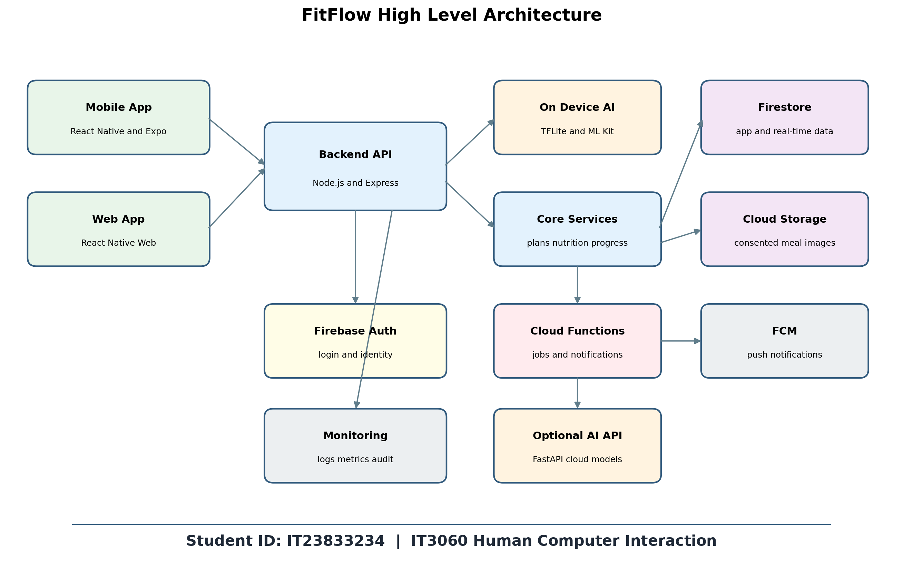
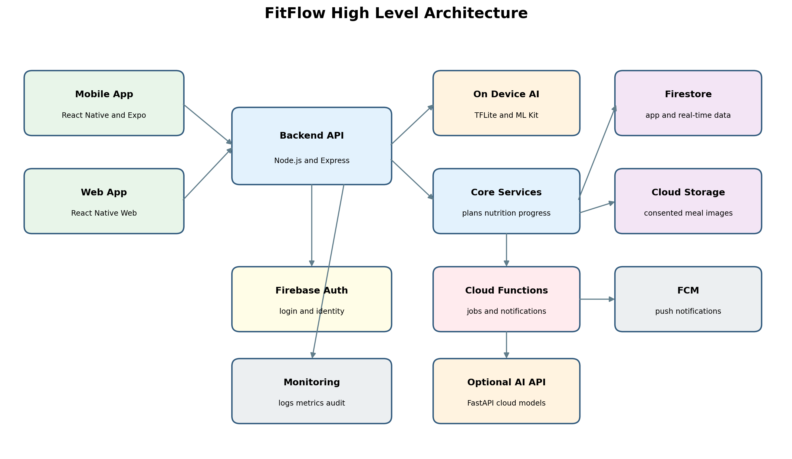

# FitFlow Redesign

FitFlow is a fitness tracking application redesigned as part of the IT3060 Human Computer Interaction module.

The redesign was developed based on user research, thematic analysis, interface prototyping and usability testing completed during Lab Exercises 1, 2, 3 and 4.

## Identified User Problems

The user research identified four main problems:

- Personalization Gap
- Social Isolation
- Nutrition Tracking Friction
- Waning Motivation

## Main Features

- AI-powered personalized workout plans
- Automatic workout adjustment after missed sessions
- Clear explanations for AI recommendations
- Camera-based food recognition
- Quick nutrition logging
- Private community groups and challenges
- Visual progress tracking
- Badges and streak recovery
- Secure user authentication
- Real-time notifications

## Selected Design

Variant A, the AI-First Dashboard, was selected during Lab Exercise 3 with a score of 23 out of 25.

The design contains five main sections:

- Home Dashboard
- AI Workout Planner
- Nutrition Logger
- Community Feed
- Progress Tracking

## Usability Testing Results

The prototype was evaluated during Lab Exercise 4.

- Average SUS score: 81.2
- Task-completion rate: 85.7%
- Average SEQ score: 5.74 out of 7

The testing results showed that the prototype met the main usability targets.

## Lab 4 Improvements

The final implementation should include:

- A visible Change Exercise label
- A confirmation after accepting a workout plan
- A shorter onboarding process with a step indicator
- An easy manual correction option for food recognition
- A clear privacy label for private groups
- Larger text on progress charts

## Technology Stack

### Frontend

- React Native with Expo
- React Native Web

### Backend

- Node.js
- Express
- Socket.IO

### Database and Authentication

- Firebase Firestore
- Firebase Authentication

### Artificial Intelligence

- TensorFlow Lite
- ML Kit

## Project Structure

```text
fitflow-redesign/
├── frontend/
├── backend/
├── ai-service/
├── docs/
│   ├── tech-stack.md
│   └── architecture/
│       ├── ADR-001.md
│       └── fitflow-architecture-IT23829756.png
├── .gitignore
└── README.md

```
## High-Level Architecture



## Documentation

- [Technology Stack](docs/tech-stack.md)
- [Architecture Decision Record](docs/architecture/ADR-001.md)

## Student Details

- Student ID: IT23833234
- Module: IT3060 Human Computer Interaction
- Project: FitFlow Redesign
- Semester: Semester 2, 2026
- └── README.md
```

## High-Level Architecture



## Documentation
